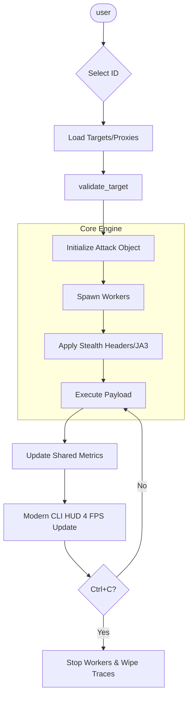

# IP-HUNTER Attack Evolution Strategy

This document outlines architectural and functional improvements for each attack vector (ID) within the IP-HUNTER ecosystem.

## 🏗️ Core Architecture Upgrades

### 1. Unified Attack Interface
- **Current**: Many attacks are standalone functions with varying signatures.
- **Proposed**: Implement an `AttackBase` abstract class. Every ID inherits from this, ensuring consistent `start()`, `stop()`, `pause()`, and `get_metrics()` methods. This allows the CLI to track progress identically across all vectors.

### 2. Signal-Driven Monitoring
- **Current**: Thread-global variables or manual increments.
- **Proposed**: Use an internal `EventEmitter` or shared `multiprocessing.Value` for real-time telemetry pipelines. This reduces UI flickering by separating data collection from rendering.

---

## ⚡ Attack ID Specific Improvements

### 🔹 Layer 7 (Application Layer)
- **ID 01, 02 (HTTP Flood)**: 
    - Implement **JA3 Fingerprinting** randomization to mimic specific browsers (Chrome/Firefox/Safari) at the TLS level.
    - Add **HTTP/2 & HTTP/3 support** natively in the basic flood.
- **ID 05 (Slowloris)**: 
    - Add "Drip-Feed" logic where header intervals are randomized to evade behavioral WAFs.
- **ID 08 (Cloudflare Bypass)**:
    - Integrate `tls_client` or `nodriver` to solve JS challenges (Turnstile/hCaptcha) automatically.
- **ID 14 (HTTP/2 Rapid Reset)**:
    - Update to target specific server implementation weaknesses (Go/Nginx specific exploits).
- **ID 22 (AI-Adaptive Smart Flood)**:
    - Train a lightweight reinforcement learning model to adjust throughput based on target response latency (RTT) and status codes (429/503).

### 🔸 Layer 4 (Network Layer)
- **ID 03 (SYN Flood)**:
    - Implement **TCP Window Scaling** randomization to look like legitimate varied clients.
- **ID 19 (ICMP/Ping of Death)**:
    - Add "Fractured Packet" logic—sending non-standard fragment offsets to stress reassembly buffers.
- **ID 35 (QUIC/UDP Flood)**:
    - Implement **QUIC CID (Connection ID) rotation** to prevent stateful firewalls from tracking individual streams.

### 📡 Amplification & Reflection
- **ID 06, 09, 10, 11**:
    - Add an **Auto-Scanner** for each specific protocol. Instead of just using a static text file, the tool should find fresh reflectors on the fly using Shodan/Censys API integration.
    - Implement a "Sanity Check" that verifies reflection ratio before starting full-scale flooding.

### 🕵️ Scanning & OSINT
- **ID 17 (Port Scanner)**:
    - Add **Service Probing**. Don't just detect "Open," but identify the software version (e.g., Apache 2.4.41) using banner grabbing.
- **ID 20 (Network Recon)**:
    - Integrate **SNMP Enumeration** and **mDNS discovery** to find smart devices and printers on the network.
- **ID 32 (Web Exposure Sniper)**:
    - Use a more advanced crawler (like `playwright`) to find hidden endpoints and leaked `.env` or `.git` directories that standard scanners miss.

### 🛡️ Management & Botnet (C2)
- **ID 07, 18 (Botnet)**:
    - Implement **AES-256 encrypted C2 communication**.
    - Add **Persistence mechanisms** (Auto-start for bot clients on Windows/Linux).
    - Implement **DGA (Domain Generation Algorithm)** so bots can find the C2 server even if the main IP is taken down.

---

## 🗺️ Mermaid Workflow: Unified Attack Execution

## 📋 Next Steps for Implementation
1. [ ] Refactor `src/attacks/` into a class-based structure.
2. [ ] Integrate `tls_client` for better L7 stealth.
3. [ ] Build the Shodan/Censys API integration for Amplification IDs.
4. [ ] Enhance the C2 server with a persistent database (SQLite).
